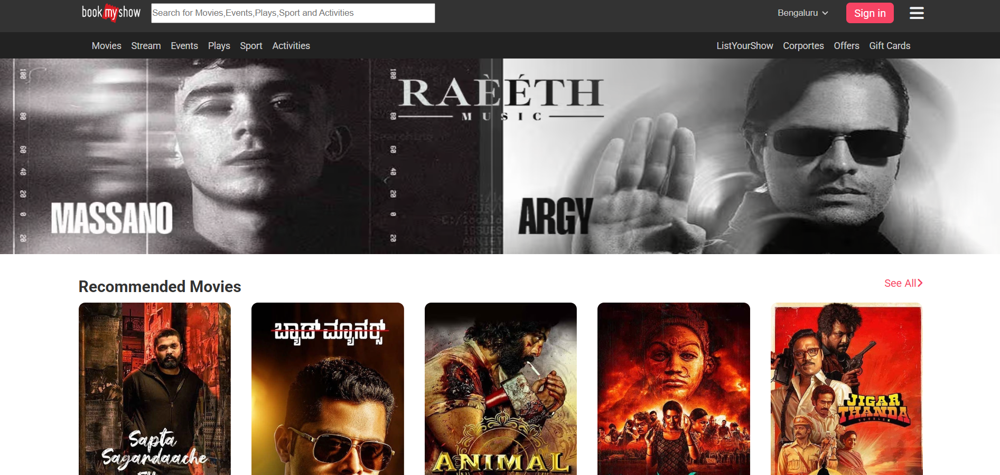

# BookMyShow Clone 🎬🍿

A Java-based web application mimicking BookMyShow's core features, including homepage, user authentication, admin panel, and movie browsing.

---

## Table of Contents
- [Project Overview](#project-overview)
- [Features](#features)
- [Tech Stack](#tech-stack)
- [Project Structure](#project-structure)
- [Setup & Installation](#setup--installation)
- [Screenshots](#screenshots)

---

## 📖 Project Overview

This **BookMyShow Clone** is built using:

- **Backend**: Java, Servlets, JSP, JDBC  
- **Frontend**: HTML5, CSS3, Bootstrap 5, jQuery  
- **Database**: MySQL  
- **Architecture**: MVC Pattern  

### 🔑 Key Features:
- User registration/login with password hashing
- Movie browsing with filters
- Admin dashboard for content management
- Responsive design for all devices

---

## 🚀 Features

### 👤 User Features
- ✅ Secure authentication (register/login/logout)
- ✅ Movie browsing with search and filters
- ✅ User profile management
- ✅ Responsive UI

### 🛠️ Admin Features
- 🔧 User management (view/delete)
- 🔧 Movie CRUD operations

---

## 🧰 Tech Stack

| Layer                | Technologies Used                            |
|----------------------|-----------------------------------------------|
| **Frontend**         | HTML5, CSS3, Bootstrap 5, jQuery              |
| **Backend**          | Java, Servlets, JSP                           |
| **Database**         | MySQL 8.0                                     |
| **Security**         | Session Management, Password Hashing          |
| **Build Tool**       | Maven                                         |
| **Server**           | Apache Tomcat 9+                              |
| **Version Control**  | Git                                           |

---

## 🗂️ Project Structure

```
bookmyshow-clone/
├── src/
│ ├── main/
│ │ ├── java/
│ │ │ └── com/bookmyshow/
│ │ │ ├── controller/ # Servlets
│ │ │ ├── dao/ # Database operations
│ │ │ ├── model/ # POJOs
│ │ │ └── service/ # Business logic
│ │ ├── resources/ # Config files
│ │ └── webapp/
│ │ ├── WEB-INF/
│ │ │ └── web.xml # Web configuration
│ │ ├── assets/
│ │ │ ├── css/
│ │ │ ├── js/
│ │ │ └── images/
│ │ ├── jsp/ # Dynamic views
│ │ └── index.html # Landing page
├── pom.xml # Maven configuration
└── README.md # Project documentation
```

"""
## 🔧 Build the Project

```bash
mvn clean install
```

## 🌐 Access the App
```
http://localhost:8080/bookmyshow-clone
```

## 📸 Screenshots
| Page | Screenshot |
|------|------------|
| 🠠**Homepage** |  |
| 🔠**Login/Register** |  |
| 🬠**Movie Listing** |  |
| 🛠️ **Admin Dashboard** |  |


## 🔗 Connect with Me
- **GitHub**: [@UdayDev24](https://github.com/UdayDev24)  
- **LinkedIn**: [Your Name](https://linkedin.com/in/uday-m-005a0819b/)  
- **Email**: uday864ud@gmail.com


